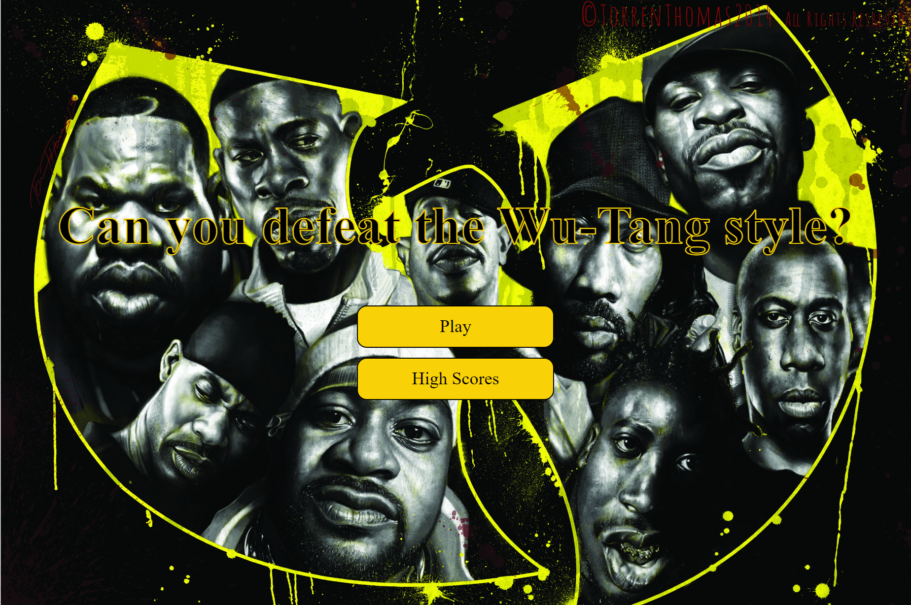

# Wu-Tang Trivia Quiz

## Table of Contents
- [Description](#description)
- [Link to Website](#website-link)
- [Github Repository](#github-repo)
- [Screenshot](#screenshot)
- [Liscense](#license)

#
#
### Description
#### This project was to learn the functionality of Javascript and how to create dynamic web pages. Questions are stored in an array and randomly called and subtracted from question bank. A timer function is initiated when quiz begins and displayed to user. After completion of game the user is able to store their initials for high scores, this is done using a local storage object. Correct/incorrect answers are shown by adding css classes with javascript selectors.

#

### Link to Website: [Wu-Tang Trivia](https://yogibruce.github.io/quizApp/)

### Github Repository: [portfolio-page](https://github.com/YogiBruce/QuizApp)

#
### Screenshot

#
### License [MIT](http://choosealicense.com/licenses/mit/)